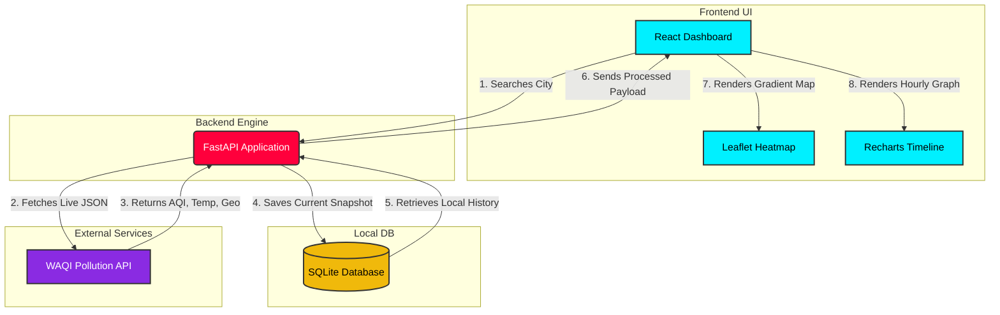
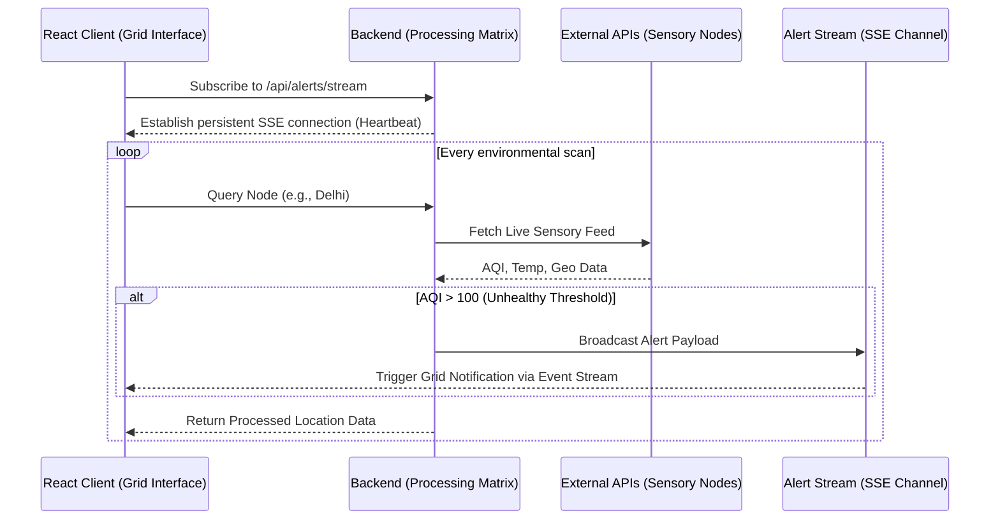

# 🕸️ SPIDER-NET AQI | Environmental Intelligence Grid


**SPIDER-NET AQI** is a real-time, highly responsive environmental dashboard. It allows users to instantly scan any city globally to retrieve live Air Quality Index (AQI) metrics, temperature, and geographic heatmaps. 

Built for speed and resilience, it utilizes a decoupled architecture where a blazing-fast Python backend proxies live data from external APIs and caches it locally for historical trend analysis.

## ✨ Key Features

* **Real-Time Environmental Scanning:** Fetches live AQI and temperature data using the WAQI API.
* **Interactive Regional Heatmap:** Renders a geographical heatmap of the scanned region using Leaflet.
* **Local Database Timeline:** Tracks and visualizes the last 7 hours of local scans using Recharts.
* **Dynamic Data Backfill Engine:** A custom algorithm that intelligently simulates realistic historical variance for newly searched cities, ensuring the UI timeline never breaks or appears empty on a first-time scan.

---

## 🏗️ System Architecture

Our platform routes user requests through a FastAPI engine, which manages external API calls and local SQLite caching.



## 🌐 The Environmental Grid Concept

SPIDER-NET operates as a pervasive "Environmental Grid." Rather than treating AQI data as isolated data points, the system interlinks geographic nodes, historical variance, and live atmospheric conditions to weave a comprehensive web of environmental intelligence. 

### Core Grid Components

* **Sensory Nodes:** The WAQI endpoints act as the physical sensory nodes of the grid, capturing raw atmospheric variables globally.
* **Processing Matrix:** The FastAPI engine acts as the central processing matrix, filtering, routing, and normalizing the sensory data for consumption.
* **Memory Fabric:** The local SQLite caching mechanism acts as the memory fabric, allowing the grid to remember past states and simulate continuity even when new nodes are integrated.
* **Visual Interface:** The React dashboard provides a human-readable interface to the grid, translating complex data streams into actionable visual insights.

### 🔄 SSE Alert Flow Sequence

Our grid features a real-time event-driven architecture to alert users of critical atmospheric changes as they happen:



### 🧩 Component Block Matrix

The architectural layout of the SPIDER-NET grid ecosystem:

```mermaid
flowchart TB
    classDef frontend fill:#00f0ff,stroke:#333,stroke-width:2px,color:#000;
    classDef backend fill:#ff003c,stroke:#333,stroke-width:2px,color:#fff;
    classDef data fill:#f0b90b,stroke:#333,stroke-width:2px,color:#000;

    subgraph User_Interface [Frontend: React Grid Terminal]
        UI_Dash[Dashboard Engine]:::frontend
        UI_Map[Leaflet Geo-Renderer]:::frontend
        UI_Graph[Recharts Data Visualizer]:::frontend
        UI_Alert[SSE Alert Manager]:::frontend
    end

    subgraph Core_Matrix [Backend: FastAPI Processor]
        API_Route[Main Router]:::backend
        API_SSE[SSE Event Streamer]:::backend
        API_Logic[Decision Engine & Backfill]:::backend
    end

    subgraph Data_Layer [Information Repositories]
        DB_Local[(SQLite Memory Fabric)]:::data
        API_External([WAQI Sensory Network]):::data
    end

    %% Connections
    UI_Dash <-->|HTTP REST| API_Route
    UI_Alert <..>|Persistent SSE| API_SSE
    
    API_Route --> API_Logic
    API_Logic <--> DB_Local
    API_Logic <--> API_External
    API_Route --> API_SSE
    
    UI_Dash --> UI_Map
    UI_Dash --> UI_Graph
```
